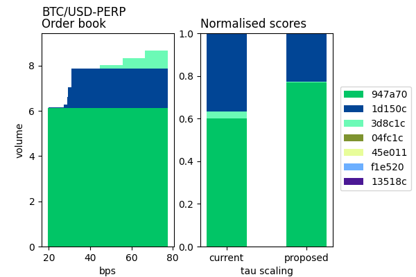
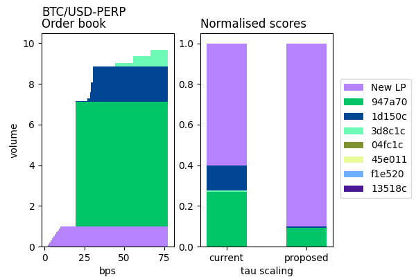

# Mainnet Governance Templates

The proposals listed in this folder can be used to create proposals in mainnet if and when the community decides to do so. The proposal templates have been created to work in mainnet after the Palazzo release (0.74.x), however, any community member intending to use these should carefully check the parameter values and ensure that they are as desired.

> [!IMPORTANT]t
> A number of fields have been left with *TO_UPDATE*, members of the community will need to complete these with relevant values as required.

## Full list of proposals

  | #   | Type           | Name                        | Description |
  | --- | -------------- |---------------------------- |----------- |
  | 1   | Network parameters  | [update_network_parameters.json](./update_network_parameters.json)     | Propose governance vote to update the tau scaling parameters      |
  | 2   | Market update | [update_markets.json](./update_markets.json)   | Propose governance vote to update existing markets with the new mark price configuration  |

### Update network parameters

This proposal changes the `market.liquidity.probabilityOfTrading.tau.scaling` from a value of `1` to a value of `0.1`. The network parameter value range restrictions were changed as a result of this [specification change](https://github.com/vegaprotocol/specs/pull/2134/files) allowing values lower than `1`. In addition to this an associated change of the `market.liquidity.minimum.probabilityOfTrading.lpOrders` parameter is proposed taking the value from `0.000001` to `0.001`.

#### Rationale

Currently when calculating a liquidity providers (LP) liquidity score, the network calculates the cumulative notional volume of their orders weighted by each orders probability of trading.

To incentivise a tighter spread by rewarding competitive liquidity providers with a larger proportion of the liquidity fees; an update to tau scaling could be suggested to reduce the probability of trading given by the risk model for orders placed further from the best-bid / ask.

#### Impact

The figure below demonstrates how the normalised liquidity scores for each existing LP would change after updating tau scaling from `1` to `0.1`. liquidity providers providing volume close to the best-bid / ask would see the greatest increase in their normalised liquidity scores.

The figure below demonstrates how a new LP willing to meet the minimum commitment by providing volume with a tight spread would now receive a greater liquidity score. This also demonstrates the incentive for existing liquidity providers to compete on the best-bid / ask as doing so reduces the weighted volume of their competitors orders.

### Update markets

The Palazzo release (0.74.x) has introduced changes to the [liquidity provider fee settings](https://github.com/vegaprotocol/roadmap/issues/81), [liquidation mechanism](https://github.com/vegaprotocol/roadmap/issues/85) and the [mark price and perpetual funding TWAP updates](https://github.com/vegaprotocol/roadmap/issues/89). Due to these changes it is now possible to set market parameters for the `liquidityFeeSettings` method, `liquidationStrategy` configuration and the `markPriceConfiguration` parameters respectively. This proposal is to update the current mainnet BTC/USD and ETH/USD markets in order for the these markets to benefit from the implemented code changes.

#### Liquidity provider fee setting

##### Proposed value(s)

No change for now, and is for the market makers propose to change later once the [liquidity provider fee settings](https://github.com/vegaprotocol/roadmap/issues/81) specifications have been understood.

##### Rationale

With additional flexibility in setting the liquidity fee, two new methods have been introduced as options for liquidity fee setting: the [Stake Weighted Average method](https://github.com/vegaprotocol/specs/blob/palazzo/protocol/0042-LIQF-setting_fees_and_rewarding_lps.md#stake-weighted-average-method-for-setting-the-liquidity-fee-factor) and the [Constant Liquidity Fee Method](https://github.com/vegaprotocol/specs/blob/palazzo/protocol/0042-LIQF-setting_fees_and_rewarding_lps.md#constant-liquidity-fee-method)

#### Mark price and “composite” internal price for perpetual funding TWAP updates

For information on the new mark price feilds and how they are used please see the [vega docs site](https://docs.vega.xyz/testnet/tutorials/proposals/new-perpetuals-market#mark-price-configuration).

##### Proposed value(s)

The proposed value sits in section `markPriceConfiguration`, with `decayWeight` set to `1.0`, `decayPower` set to `1`, `cashAmount` set to `5000000`, and `sourceWeights` set to `["0.0", "0.0", "0.0", "1.0"]` which means `median` is used as the mark price data source. `sourceStalenessTolerance` is set to `["1m", "1m", "1m", "1m"]`, `compositePriceType` is set to `COMPOSITE_PRICE_TYPE_WEIGHTED` which means mark price is weighted price from data source where external data source is set in section `dataSourcesSpec`.

##### Rationale

For perpetual futures markets, there are now flexible configuration options for both mark price and the composite internal price for funding. This allows the market to potentially use different mark price methods for mark-to-market and price monitoring, and a completely different price for calculating funding (for perpetual futures markets).

#### Liquidation strategy improvements

##### Proposed value(s)

Liquidation strategy is a new section which can be set in `liquidationStrategy` while `disposalTimeStep` is set to `30`, `disposalFraction` is set to `0.1`, `disposalFraction` is set to `0`, and `maxFractionConsumed` is set to `0.1`

##### Rationale

Improvements have been made to how distressed parties are liquidated. This configuration is used to allow the network to hold an active position on the market. Parties that are distressed, but previously couldn't be liquidated because there was insufficient volume on the book, will now be liquidated. In this process the party's position is transferred to the network party, and rather than dumping the distressed volume on the market, an inventory management strategy carries this out over time.
